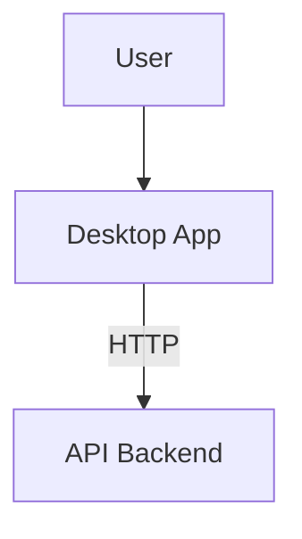

# Architecture Diagram

```mermaid
graph TD;
  User[User]
  Desktop[Desktop App]
  API[API Backend]
  User --> Desktop
  Desktop -->|HTTP| API
```

This diagram shows how the desktop app interacts with the backend API.